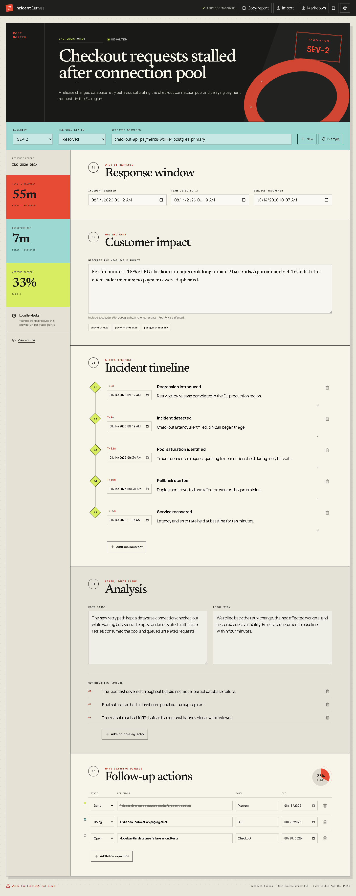
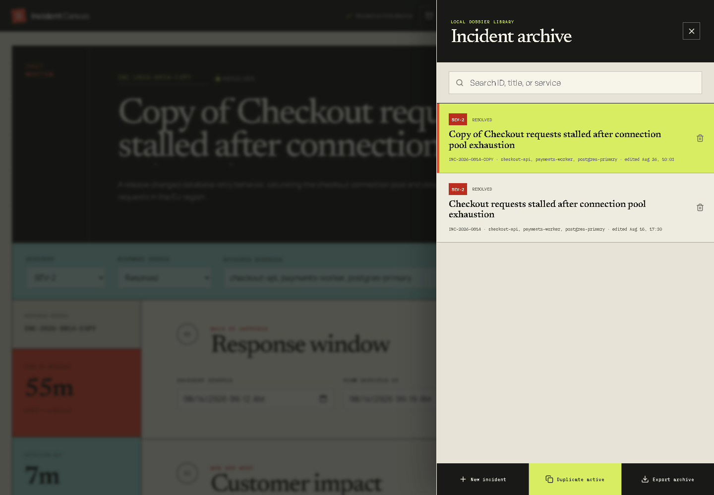

# Incident Canvas

[](https://github.com/kyan9400/incident-canvas/actions/workflows/ci.yml)
[](https://github.com/kyan9400/incident-canvas/actions/workflows/deploy-pages.yml)
[](https://github.com/kyan9400/incident-canvas/releases)
[](LICENSE)

A local-first workspace for writing clear, accountable incident postmortems. Capture the response window, impact, timeline, analysis, and owned follow-up actions in one portable report.

**[Open the live app](https://kyan9400.github.io/incident-canvas/)**



## Why it exists

Postmortems often begin as scattered timestamps and end as documents that are hard to maintain. Incident Canvas keeps the workflow focused:

- calculate detection and recovery time directly from the response window;
- build a readable sequence of decisions and system changes;
- separate root cause, contributing factors, and resolution;
- give every follow-up an owner, due date, and state;
- keep up to 50 incidents in a searchable local archive;
- duplicate reports and move complete archives between browsers;
- export review-ready Markdown or portable JSON;
- keep operational data on the device—there is no backend or analytics.

The included example is intentionally realistic, so the product can be evaluated without setup.

## Privacy and portability

Reports are saved under a versioned browser archive key. Existing version 1 single-report storage is migrated automatically. Imported incident and archive JSON is validated and normalized before it reaches application state, with length and collection limits to keep malformed files bounded. Nothing is transmitted by the application.



Use **Markdown** for a human-readable review document, single-incident **JSON** for one report, or **Export archive** to move the complete local library between browsers. Archive imports merge by incident identifier instead of silently creating duplicates. Printing produces a compact report layout.

## Run locally

Requirements: Node.js 24+ and pnpm 11+.

```bash
corepack enable
pnpm install
pnpm dev
```

Quality checks:

```bash
pnpm lint
pnpm test
pnpm build
```

## Architecture

Incident Canvas is a static React and TypeScript application built with Vite. Business rules live in pure functions under `src/lib`, while the UI derives metrics from the current incident during render. Persistence is isolated behind a small storage adapter and uses a lazy state initializer to avoid startup effects.

The test suite covers time calculations, import normalization, archive migration and merging, Markdown generation, editing, local persistence, and follow-up completion. GitHub Actions runs lint, tests, and a production build on every pull request; successful pushes to `main` deploy to GitHub Pages.

Tags publish tested source and production-site archives. A Pages deployment can be rolled back by running the deployment workflow from an earlier release tag.

## Project status

Version 1.1 supports a searchable multi-incident archive, duplication, safe deletion, legacy migration, and portable archive bundles. Encrypted sharing remains out of scope because the application has no server or key-management boundary.

Contributions are welcome. See [CONTRIBUTING.md](CONTRIBUTING.md) and [SECURITY.md](SECURITY.md).

## License

[MIT](LICENSE) © Hassan Ak
